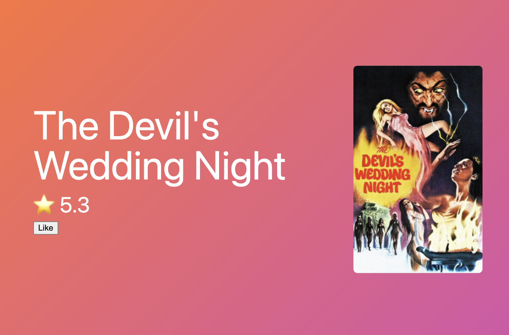

# GraphQL로 영화 웹 앱 만들기

<p align="center">

</p>

## Movie Web
> 개발 기간 : 2024.04.01 ~ 2024.04.03

<br/>

# Guide

### Installation
```
$ git clone https://github.com/yun0727/movieql-client.git
```

<br/>

# Stacks
### Environment


### Development


### Deploy


<br/>

# 주요 기능
* useQuery를 사용해서 리액트에서 GraphQL 데이터를 가져오고 그 결과를 UI에 연결
* Local Only Fields, writeFragment를 사용하여 캐시된 데이터에 대한 변경 사항 적용 
